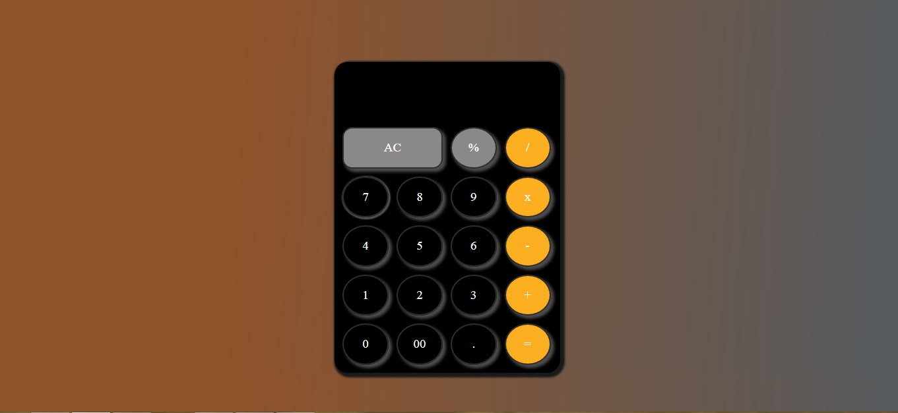
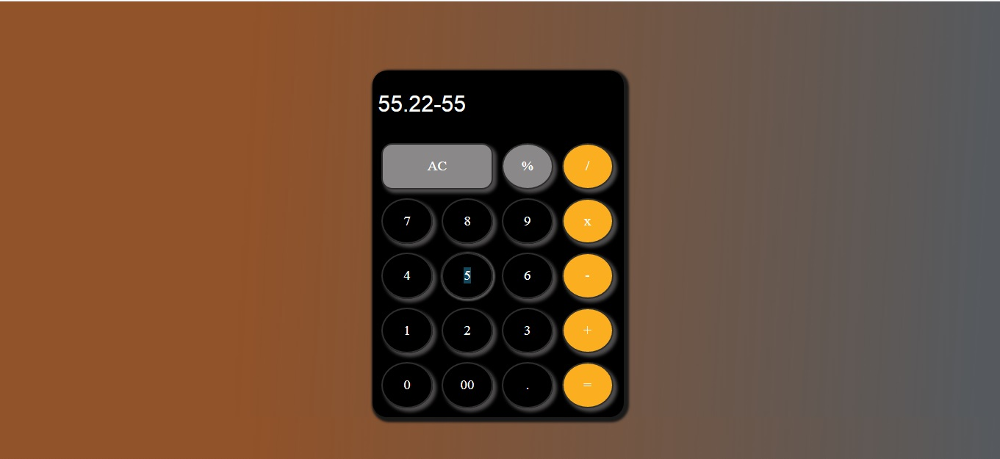
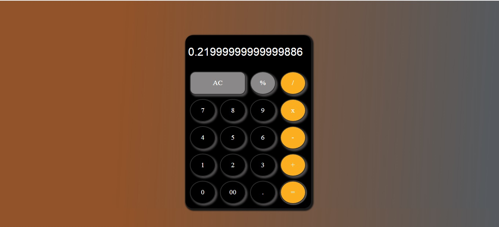

# Basic Calculator

## Description :
The basic calculator is a simple tool that allows users to perform arithmetic calculations such as addition, subtraction, multiplication, and division. It consists of a user interface with numeric buttons, operator buttons, and a display area to show the input and result.

To create the basic calculator, I have used HTML, CSS, and JavaScript.

In HTML, I have structured the calculator's user interface using 
 elements. I have created a 
 to display the input and result, and another set of 
 elements to hold the numeric buttons (0-9) and operator buttons (+  -  *  / ) .

CSS is used to style the calculator and make it visually appealing. 

Following CSS properties are used :
 -   ####  Grid Layout
 -   ####  width
 -   ####  height
 -   ####  background-color
 -   ####  border
 -   ####  font-size 

In JavaScript, I have handled the calculator's functionality. I have used an event listeners to detect button clicks and perform the corresponding calculations. I have also writen functions to handle input validation and update the display area with the input and result.

To clear the input and result, "AC" button is provided  that resets the display area.

# working :
When a numeric button is clicked, the corresponding digit will be appended to the input. If an operator button is clicked, it will check if there is a valid input and perform the calculation based on the selected operator. The result will be displayed in the output area.

## Screenshots

# Technologies Used

- HTML
- CSS
- Javascript
